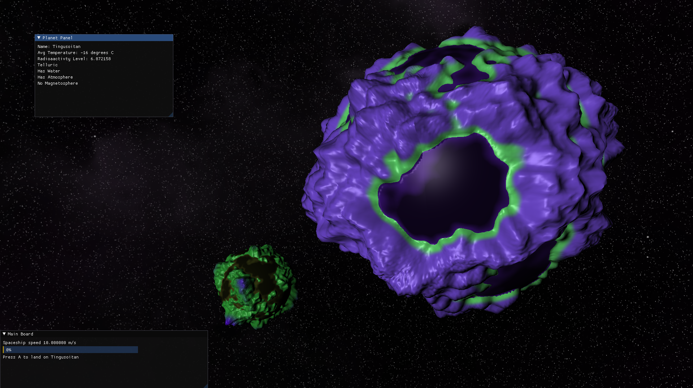

# Space-Explorer
Space Explorer is a 3D Game written in C++ using OpenGL 3.3, GLFW and GLAD.

## Rules
You embody an individual of an alien species at the controls of a spaceship. This one is adrift and damaged, it must land on a planet as quickly as possible to carry out repairs. 
You are in a solar system made up of several planets. 
However, the on-board computer had been damaged so the ship is unable to tell you which planet to land on. 
Your objective is to explore the system for information on the various planets and the species you play as. 
Your goal is therefore to find the planet in the system that best matches your species.

## Screenshots

![[screenshot02]](doc/Space_Explorer_02.PNG)

![[screenshot03]](doc/Space_Explorer_03.PNG)